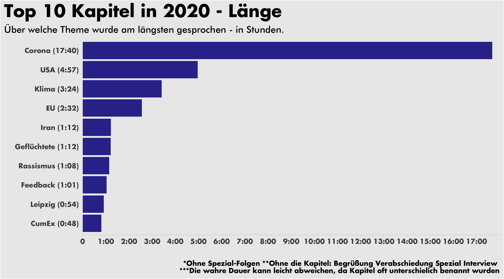
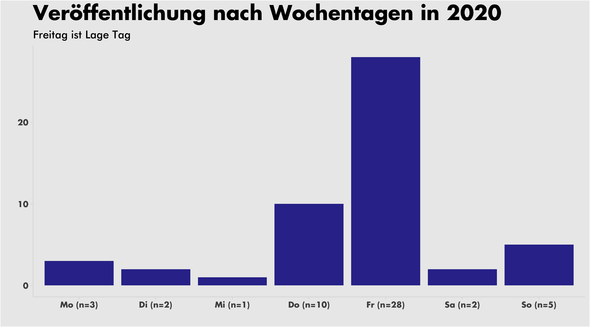

# Lage-der-Nation-2020
Anaylse der öffentlichen Folgen des Podcasts Lage der Nation aus dem Jahr 2020

Ein Paar Visualisierungen zum Podcastjahr 2020 der Lage der Nation.

Als Datenquelle wurde der RRS Feed genutzt.

